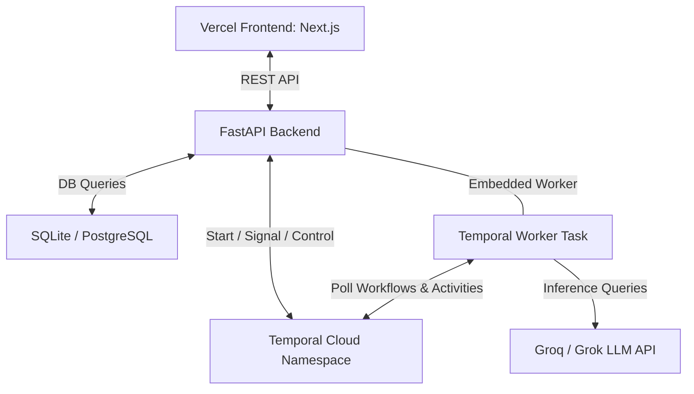

# AI Order Supervisor

A proof-of-concept (POC) for a long-running AI supervisor that oversees a single order from creation until completion. The system manages order lifecycles via Temporal workflows, uses a lightweight event classifier to control wake/sleep states, executes targeted business actions via an LLM agent, and generates structured post-run summaries.

---

## Architecture Overview



- **Frontend**: Next.js (App Router), styled with Tailwind CSS, deployed on **Vercel**.
- **Backend**: Python (FastAPI) running an **embedded Temporal Worker** in a background task (lifespan task) to fully support Render's free tier (no separate worker service cost).
- **Orchestration**: Temporal Cloud using API Key Authentication.
- **Persistence**: SQLite (local) / Neon PostgreSQL (production).
- **Agent Reasoning**: Groq API (using the `llama-3.3-70b-versatile` model).

---

## Key Features

1. **Long-Running Temporal Workflow**: Spawns one workflow per order, staying active until a terminal event (`delivered`) or manual termination.
2. **Dynamic Wake/Sleep Scheduling**: The agent decides how many hours to sleep. The workflow utilizes Temporal Timers to sleep efficiently without blocking.
3. **Event-Driven Classifier**: Immediate wake-ups for urgent events (`payment_failed`, `shipment_delayed`, `refund_requested`, `customer_message_received`, `delivered`) and unclassified events; standard events are queued until the next scheduled wake-up.
4. **Agent Action Whitelist**: Executes and logs 5 business actions: `message_fulfillment_team`, `message_payments_team`, `message_logistics_team`, `message_customer`, and `create_internal_note`.
5. **On-the-Fly Instructions**: Inject custom guidelines to a live run (e.g., *"Do not contact the customer directly"*), waking the agent to immediately absorb new context.
6. **End-of-Run Summary**: Automatically generates a structured report with key learnings and recommendations upon completion.

---

## Local Setup & Installation

### Prerequisites
- **Python**: 3.9 or higher
- **Node.js**: 18.x or higher
- **Temporal**: A running local Temporal server (`temporal server start-dev`) OR a Temporal Cloud Namespace with an API Key.
- **Groq API Key**: A valid key from the Groq console.

---

### 1. Backend Setup

1. Navigate to the root directory and create a virtual environment:
   ```bash
   python -m venv venv
   source venv/Scripts/activate  # On Windows: venv\Scripts\activate
   ```

2. Install dependencies:
   ```bash
   pip install -r requirements.txt
   ```

3. Configure environment variables. Create a `.env` file in the root directory:
   ```env
   # Database Configuration (Defaults to local SQLite)
   DATABASE_URL=sqlite:///./order_supervisor.db

   # Temporal Cloud Configuration (Leave blank for local Temporal development)
   TEMPORAL_HOST=localhost:7233
   TEMPORAL_NAMESPACE=default
   TEMPORAL_API_KEY=

   # AI Model Integration (Groq)
   GROQ_API_KEY=gsk_your_key_here
   GROQ_MODEL=llama-3.3-70b-versatile
   ```

4. Run the backend server (automatically runs the embedded worker in the background):
   ```bash
   python -m uvicorn backend.main:app --reload
   ```

---

### 2. Frontend Setup

1. Navigate to the `frontend` directory:
   ```bash
   cd frontend
   ```

2. Install Node modules:
   ```bash
   npm install
   ```

3. Create a `.env.local` file for development environment variables:
   ```env
   NEXT_PUBLIC_API_URL=http://localhost:8000
   ```

4. Run the development server:
   ```bash
   npm run dev
   ```

   The UI will be accessible at `http://localhost:3000`.

---

## Production Deployment Guides

### Backend (Render)
1. Deploy as a **Web Service** from your Git repository.
2. In the Render Dashboard under **Environment Variables**, set:
   - `DATABASE_URL` (Neon PostgreSQL URI)
   - `TEMPORAL_HOST` (e.g., `order-supervisor.hyehy.tmprl.cloud:7233`)
   - `TEMPORAL_NAMESPACE` (e.g., `order-supervisor.hyehy`)
   - `TEMPORAL_API_KEY` (Temporal Cloud API Key)
   - `GROQ_API_KEY` (Groq API Key)
   - `GROQ_MODEL` (`llama-3.3-70b-versatile`)

### Frontend (Vercel)
1. Import the project subfolder `frontend` to Vercel.
2. Set the environment variable:
   - `NEXT_PUBLIC_API_URL` to your Render backend web service URL.
